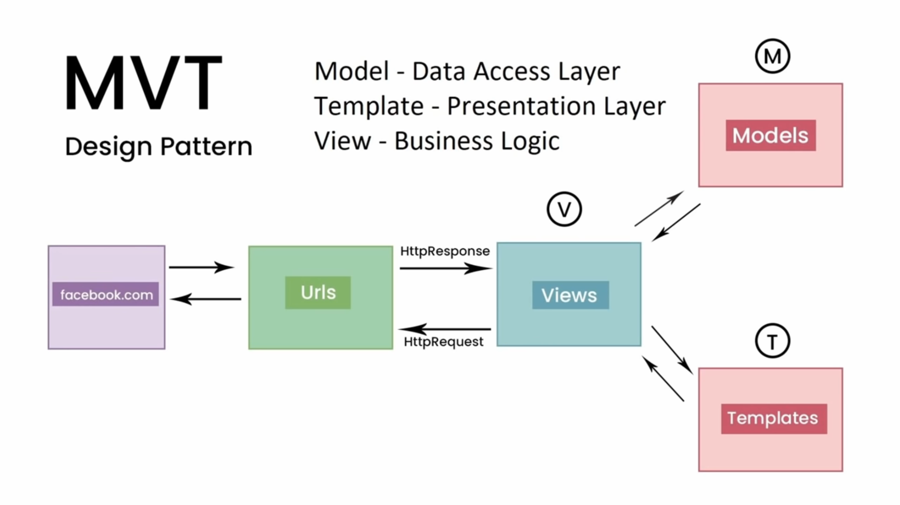

# Django 🚀

Django follows MVT architecture

### Starting Off

1. **Creating a New Project 🏗️**
```py
django-admin startproject demoproject
```
This command initializes a new Django project called "demoproject".

2. **Creating a New App 📦**
```py
python manage.py startapp lemonslame
```
This sets up a new app within your Django project called "lemonslame".

3. **Running the Server 🌍**
```py
python manage.py runserver
```
Starts the development server, allowing you to access your project in the browser.

### Migrations 🔄

Migrations are how Django manages changes to your models and translates those into changes in your database structure.

1. **Preparing Migrations**
```py
python manage.py makemigrations
```
This generates the SQL commands needed for any changes made to your models.

2. **Applying Migrations**
```py
python manage.py migrate
```
Executes the previously generated SQL commands, updating the database structure.

3. **Viewing Migration History 📜**
```py
python manage.py showmigrations
```
Lists all the migrations that have been applied or are pending.

### Traversing Back to Previous Model 🔄

If you made an error or want to revert back to an older migration:

1. **Planning the Rollback 🔍**
```py
python manage.py migrate lemonslame 0002 --plan
```
This will show which migrations will be undone when reverting back to "0002".

2. **Executing the Rollback ⏪**
```py
python manage.py migrate lemonslame 0002
```
Rolls back the migrations, reverting to the state of "0002".

3. **View SQL for a Migration 📋**
```py
python manage.py sqlmigrate lemonslame 0001
```
Displays the actual SQL commands Django will use for the "0001" migration.

### Admin Access 🔐

**Creating a Superuser for Admin Access 🦸**
```py
python manage.py createsuperuser
```
This lets you create a superuser account, granting you full access to the Django Admin dashboard.
